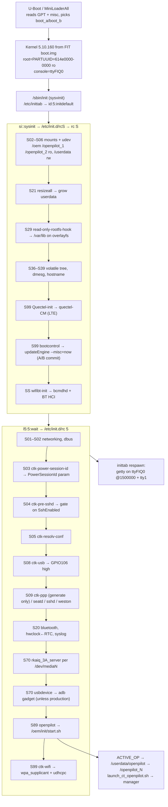
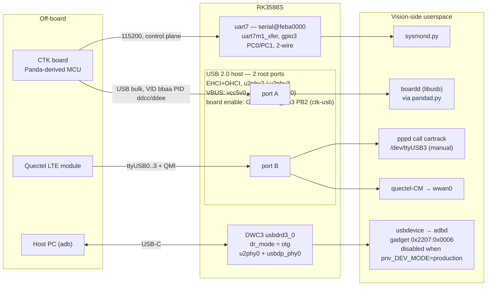

# Yocto in tvi-linux (CTKVision RK3588) — how the image is built and what it contains

Orientation reference for the Yocto/BSP side of the **CTKVision** vision camera
(Rockchip RK3588S, board **TVI1503R**). Sections 1–2 explain the build machinery;
sections 3–10 answer the concrete "what's inside the image" questions.

**How this was derived:** direct inspection of the running SDK container
`relaxed_heisenberg` (image `yocto-image-full:latest`, SDK tree at
`/opt/tvi-linux-meta/tvi-linux`, caches/outputs at `/workspace`), including the
decompiled board DTB and the built `rootfs.img` from the last completed build
(`/workspace/output/RK3588S-TVI1503R-LP4X-LINUX/20260708_141406`).

**Primary sources:** `ci/run-yocto-inside-image.sh`, `files/tools/command/build.sh`,
`device/rockchip/common/scripts/mk-rootfs.sh`, `yocto/build/conf/**`,
`yocto/meta-cartrack/**`, `yocto/meta-rockchip/conf/machine/**`,
`device/rockchip/rk3588/parameter-ab.txt`,
`kernel/arch/arm64/boot/dts/rockchip/rk3588s-TVI1503R-lp4x-linux.dts`,
`device/rockchip/common/overlays/overlay-yocto/etc/init.d/{ctk-usb,ctk-ppp,usbdevice.sh}`,
`device/rockchip/common/post-hooks/02-usb.sh`.
For the CTK-board link (§7.4), cross-checked against the openpilot repo:
`docs/daemons-and-protocols.md`, `system/sysmond/sysmond.py`, `panda/python/__init__.py`,
`selfdrive/boardd/pandad.py`.
Companion doc in the repo: **`docs/tvi-linux-build-sequence.md`** (stage-by-stage build
orchestration — read that for *how the pipeline runs*; this doc is *what it produces*).

> **Freshness caveat.** The build artifacts inspected in the container are dated
> **2026-07-08** and predate two later commits: `/etc/version` release-version embedding
> (`9086887`) — the cached rootfs still carries the poky placeholder `20180309123456` —
> and the `updateEngine` staging/commit split (`4936c86`), whose `bootcontrol` init script
> is not yet in the cached `/etc/init.d`. Everything else below matches the current tree.

---

## 1. The two build systems

The single most important structural fact: **bitbake does not build the kernel or U-Boot.**

| Component | Built by | Artifact |
|---|---|---|
| Kernel `Image` + board DTB + `boot.img` | Rockchip `make -C kernel/` (`mk-kernel.sh`), prebuilt GCC ARM 10.3 toolchain | `boot.img` (FIT) |
| U-Boot / loader | Rockchip `make` (`mk-loader.sh`) | `MiniLoaderAll.bin`, `uboot.img` |
| **Rootfs** (`core-image-minimal`) | **bitbake** | `rootfs.img` (ext4) |
| **Cross SDK** (`populate_sdk`) | **bitbake** | `poky-glibc-x86_64-core-image-minimal-armv8a-rockchip-rk3588-evb-toolchain-4.0.9.sh` |
| Firmware assembly / `update.img` | `afptool` + `rkImageMaker` | `update.img`, `update_ab.img`, `update_ota.img` |

Yocto *does* still build `linux-rockchip` 5.10 from the same local `kernel/` tree (SRC_URI
`git://${TOPDIR}/../../kernel`, `SRCREV = ${AUTOREV}`) — but only to produce the
**kernel modules** package that lands in the rootfs (`MACHINE_EXTRA_RRECOMMENDS += kernel-modules`).
The `Image` that actually boots comes from the `make` build.

### Entry point

`ci/run-yocto-inside-image.sh` (shared by local `./build.sh` and GitLab CI) wires the caches and
hands off:

```
ci/run-yocto-inside-image.sh
  ├── DL_DIR=/workspace/packages      → symlinked to yocto/packages
  ├── SSTATE_DIR=/workspace/sstate-cache → symlinked to yocto/build/sstate-cache
  ├── CCACHE_DIR=/workspace/ccache    (backs the make kernel/u-boot build; sstate does not cover it)
  ├── RK_OUTDIR=/workspace/output
  ├── chmod -R a+rwX on the caches    (bitbake runs as `builduser`, uid 6000)
  └── ./tools/command/build.sh  →  ./build.sh (vendor, target `allsave`)
       ... then ci-extract-artifacts-from-output.sh, then verifies /etc/version in the ext4
```

`tools/command/build.sh` pins `RK_ROOTFS_SYSTEM=yocto`, caps parallelism
(`BB_NUMBER_THREADS=3`, `PARALLEL_MAKE=-j 4`, `RK_JLEVEL=4`, `BR2_JLEVEL=4`), and resolves the
release version into `device/rockchip/common/scripts/.ctk-version`
(CI: `v${VERSION_NUMBER}.${CI_PIPELINE_IID}`; local: `v0.0.<timestamp>` — major 0 is reserved
for local builds).

### Yocto base

| | |
|---|---|
| Distro | **poky 4.0.9 "kirkstone"** |
| Image target | `core-image-minimal` (+ `CORE_IMAGE_EXTRA_INSTALL = packagegroup-ctk-linux`) |
| MACHINE | `rockchip-rk3588-evb` (`meta-rockchip`), SOC_FAMILY `rk3588` |
| Package format | **`package_deb`** (dpkg DB is stripped from the final read-only rootfs) |
| Image features | `debug-tweaks read-only-rootfs`, `ssh-server-openssh` |
| Display platform | **wayland** (`weston`), `DISTRO_FEATURES += egl opengl`, x11 removed |
| Layers | `meta-openembedded` (oe/python/multimedia), `meta-qt5`, `meta-clang`, `meta-rockchip`, **`meta-cartrack`**, `poky/meta`, `meta-poky`, `meta-yocto-bsp`, `meta-browser` |

`build/conf/local.conf` is **generated on every build** by `mk-rootfs.sh::build_yocto()`; it is
just an include list:

```
include include/common.conf      # base policy, PACKAGE_CLASSES, read-only rootfs, Boost pin
include include/debug.conf       # strace/gdb/adbd/glmark2/openssh
include include/display.conf     # weston + wayland
include include/multimedia.conf  # gstreamer + rkaiq server
include include/audio.conf       # alsa-utils + pulseaudio
include include/openpilot.conf   # ← Cartrack/openpilot additions (patch 0012)
MACHINE = "rockchip-rk3588-evb"
```
plus `conf/rksdk_override.conf` (kernel version pin, `MALI_VERSION := g13p0`, display platform)
passed with `bitbake -R`, and `include/rksdk.conf`, which redirects all Rockchip component
recipes to the **local repo checkouts** under `external/` with `SRCREV = ${AUTOREV}`.

> ⚠️ Trap: if `RK_YOCTO_CFG` ever ends in `.conf`, `mk-rootfs.sh` symlinks that file as
> `local.conf` and skips the whole include chain above — silently dropping `openpilot.conf`.

Two bitbake invocations run back to back:

```sh
bitbake core-image-minimal -f -c rootfs -c image_complete -R conf/rksdk_override.conf
bitbake core-image-minimal    -c populate_sdk           -R conf/rksdk_override.conf
```

### Board selection

```
device/rockchip/.BoardConfig.mk
  → .chips/rk3588/rockchip_rk3588s_TVI1503R_defconfig
        RK_YOCTO_CFG="rockchip-rk3588-evb"
        RK_KERNEL_DTS_NAME="rk3588s-TVI1503R-lp4x-linux"
        RK_USE_FIT_IMG=y
        RK_WIFIBT_TTY="ttyS9"
        RK_AB_UPDATE=y
        RK_PARAMETER="parameter-ab.txt"
```
Resolved build identity: chip `rk3588s`, kernel `5.10` (`rockchip_linux_defconfig` +
fragment `rk3588_linux.config`), output dir tag **`RK3588S-TVI1503R-LP4X-LINUX`**.

---

## 2. meta-cartrack — the custom layer

`files/yocto/meta-cartrack/` is projected into `yocto/meta-cartrack/` by `post-sync.sh`.
BitBake discovers it by filesystem scan, so new recipe files need no registration.

| Area | Contents |
|---|---|
| `recipes-support/boost/` | **Boost 1.90.0** backported from oe-core master, Kirkstone-adapted (`WORKDIR`, not `UNPACKDIR`). `common.conf` pins `PREFERRED_VERSION_boost{,-build-native} = 1.90.0` and BBMASKs `boost-url`. |
| `recipes-ctk-linux/capnproto/` | `capnproto 0.10.2` (overrides meta-oe's 0.9.1) |
| `recipes-ctk-linux/casadi/` | `casadi 3.6.4` (+ `python3-casadi`); a legacy `3.5.5` recipe still sits in the container tree but not in the repo |
| `recipes-ctk-linux/zeromq/` | `zmq-cpp-bindings` (installs `zmq.hpp` into the SDK) |
| `recipes-ctk-linux/update-engine/` | Builds `updateEngine` from `external/recovery`; installs SysV init `bootcontrol` at `S99` runlevel `S` |
| `recipes-ctk-linux/python/` | `python3-multiarch-conf` (fixes multiarch headers for cross-compile) |
| `recipes-ctk-linux/python3-*` | atomicwrites, future-fstrings, hatanaka, importlib-resources, libusb1, ncompress, platformdirs, pycapnp, pyopencl, pytools, setproctitle, smbus2, zipp |
| `recipes-ctk-linux/packagegroups/` | **`packagegroup-ctk-linux`** — the curated device runtime set |
| `recipes-core/opencl/` | bbappends for `opencl-headers` / `opencl-icd-loader` |

**Three ways a package gets in** (pick deliberately):
- `packagegroup-ctk-linux` → stable device runtime baseline (a reviewed recipe).
- `openpilot.conf` `IMAGE_INSTALL:append` → ad-hoc / still-iterating device packages.
- `openpilot.conf` `TOOLCHAIN_HOST_TASK` / `TOOLCHAIN_TARGET_TASK` → **SDK only**, never the device.

---

## 3. Device tree hierarchy

Board DTS: **`kernel/arch/arm64/boot/dts/rockchip/rk3588s-TVI1503R-lp4x-linux.dts`**
→ compiled to `rk3588s-TVI1503R-lp4x-linux.dtb`, packed into the FIT `boot.img`.

```
rk3588s-TVI1503R-lp4x-linux.dts            (24 lines — pure include list + model)
│   model      = "Rockchip RK3588S EVB4 LP4X V10 Board"
│   compatible = "rockchip,rk3588s-evb4-lp4x-v10", "rockchip,rk3588"
│
├── rk3588s-TVI1503R-MB-v01.dtsi           (362) main board: regulators, USB, SDMMC, PWM, DP
│   ├── rk3588s.dtsi                       (6277) SoC: CPUs, CRU, IOMMU, VOP, NPU, VPU/MPP, PHYs
│   │   └── rk3588s-pinctrl.dtsi
│   │       └── rk3588s-pinconf.dtsi
│   ├── rk3588s-evb.dtsi                   (1153) Rockchip EVB baseline (backlight, adc-keys, panel)
│   └── rk3588-rk806-single.dtsi           PMIC RK806 rails + suspend voltage states
│
├── rk3588-linux.dtsi                      (118) Linux-only: bootargs, fiq-debugger, OP-TEE,
│                                                CMA 8 MiB, ramoops, drm-logo, dmc/dfi, rng
├── rk3588s-TVI1503R-pcie.dtsi             (17)  pcie2x1l1 / pcie2x1l2 — both status="disabled"
├── rk3588s-TVI1503R-ap6256.dtsi           (100) WiFi/BT AP6256: sdio + uart9 + pwrseq + GPIOs
├── rk3588s-TVI1503R-hym8563.dtsi          (32)  RTC on i2c3 @0x51, wakeup-source
├── rk3588s-TVI1503R-audio.dtsi            (93)  ES7148 DAC (i2s1_8ch) + 2× ES7202 PDM mic (i2c6)
│
├── rk3588s-i2c2-dphy-TVI1503R-gc2093.dtsi (223) camera idx 2, "front"  → csi2_dphy1 → mipi2 → rkisp0_vir2
├── rk3588s-i2c8-dcphy-TVI1503R-gc2093.dtsi(219) camera on i2c8
├── rk3588s-i2c5-dcphy-TVI1503R-gc2093.dtsi(219) camera on i2c5
│
└── rk3588s-TVI1503R-ahd-nvp6324.dtsi      (151) AHD decoder "jaguar1" @i2c3 0x30, 4-lane MIPI
                                                 → csi2_dcphy0 → mipi0_csi2 → rkcif_mipi_lvds
```

Video pipeline as wired in the DT:

```
3× GC2093 (MIPI CSI-2)  ──► csi2_dphy1/dcphy0/dcphy1 ──► mipiN_csi2 ──► rkcif_mipi_lvdsN
                                                                    └──► rkispN_virN (ISP)
NVP6324 "jaguar1" (AHD, 4 analog ch → MIPI) ──► csi2_dcphy0 ──► mipi0_csi2 ──► rkcif_mipi_lvds
```

Notable board facts read out of the DTB:
- **Ethernet is disabled** (`ethernet@fe1c0000`, `rockchip,rk3588-gmac`) — connectivity is
  WiFi (AP6256/SDIO) + Quectel LTE over USB/PPP.
- **PCIe is disabled** on both controllers.
- Console: `ttyFIQ0` at 1500000 baud via `rockchip,fiq-debugger` on uart2m0.
- Boot args: `root=PARTUUID=614e0000-0000 rw rootwait`, `irqchip.gicv3_pseudo_nmi=0`.
- `ramoops@110000` (128 KiB record / 512 KiB console / 320 KiB pmsg) → pstore crash logs.

---

## 4. Device drivers included

All non-WiFi/BT drivers are **built into the kernel** (`5.10.160-rockchip-standard`).
The only `.ko` modules in the rootfs are:
`bcmdhd.ko`, `bcmdhd_pcie.ko`, `8852be.ko`, `8852bs.ko`, `hci_uart.ko`.

| Domain | Device (DT node) | Driver / Kconfig |
|---|---|---|
| CPU / PM | 4× Cortex-A76 + 4× Cortex-A55, PSCI 1.0, SDEI, SCMI-SMC | `arm,psci-1.0`, `CONFIG_ARM_SCMI_PROTOCOL`, `CONFIG_ARM_ROCKCHIP_CPUFREQ` |
| PMIC | RK806 (SPI), RK8602 ×2 + RK8603 (I2C, big-core/NPU rails) | `rockchip,rk806`, `rockchip,rk8602/rk8603` |
| GPU | Mali-G610 (Valhall, CSF) | `arm,mali-bifrost`, `CONFIG_MALI_BIFROST`, `CONFIG_MALI_CSF_SUPPORT` |
| NPU | RKNPU `npu@fdab0000` | `rockchip,rk3588-rknpu`, `CONFIG_ROCKCHIP_RKNPU` |
| Camera sensors | 3× **GC2093** (i2c2/i2c5/i2c8 @0x37) | `galaxycore,gc2093`, `CONFIG_VIDEO_GC2093` |
| Analog video | **NVP6324 / "jaguar1"** AHD decoder (i2c3 @0x30) | `jaguar1-v4l2`, `CONFIG_VIDEO_NVP6324` |
| CSI / ISP | rkcif, 4× mipi-csi2, 6× csi2 DPHY-HW, 2× rkisp, MIPI DCPHY | `CONFIG_VIDEO_ROCKCHIP_CIF/ISP`, `CONFIG_PHY_ROCKCHIP_CSI2_DPHY` |
| Video codec | MPP service: rkvdec ×2 + ccu, rkvenc ×2 + ccu, vdpu/vepu v2, 4× jpege, jpegd, AV1 dec, IEP2 | `CONFIG_ROCKCHIP_MPP_*` |
| 2D / scaler | RGA3 core0/core1 + RGA2 core0 | `CONFIG_ROCKCHIP_MULTI_RGA`, `CONFIG_VIDEO_ROCKCHIP_RGA` |
| Display | VOP `vop@fdd90000`, DP0 on vp2, DSI0/1 disabled | `CONFIG_DRM_ROCKCHIP` |
| Storage | eMMC `mmc@fe2e0000` (dwcmshc SDHCI), SD `mmc@fe2d0000`, SDIO `mmc@fe2c0000` (dw-mshc) | `CONFIG_MMC_SDHCI_OF_DWCMSHC`, `CONFIG_MMC_DW_ROCKCHIP` |
| USB | 1× DWC3 OTG (`usbdrd3_0`), 2× EHCI + 2× OHCI host ports; USBDP-PHY, 3× USB2-PHY, gadget via configfs (adb) — **see §7** | `CONFIG_USB_DWC3`, `CONFIG_USB_CONFIGFS_*`, `CONFIG_PHY_ROCKCHIP_USBDP` |
| WiFi | **AP6256** on SDIO (`wlan-platdata`, `wifi_chip_type = "ap6256"`) | `bcmdhd.ko` (`CONFIG_BCMDHD_SDIO=y` fragment); RTL8852B modules also shipped |
| Bluetooth | AP6256 BT on **uart9** (`bluetooth-platdata`) | `hci_uart.ko`, `CONFIG_BT_HCIUART` |
| WWAN | Quectel LTE module on a USB 2.0 host port — `ttyUSB0..3` + QMI `wwan0`; `quectel-CM` (auto) or pppd (manual) — **see §7.3** | `CONFIG_USB_SERIAL_OPTION`, `CONFIG_USB_NET_QMI_WWAN`, `CONFIG_PPP*` |
| CTK board link | Panda-derived MCU: USB bulk (VID `0xbbaa`) + `uart7` → `/dev/ttyS7` @115200 — **see §7.4** | `CONFIG_USB_DWC3` host, `snps,dw-apb-uart`; userspace `libusb1` |
| Serial | `uart7` (`serial@feba0000`, `uart7m1_xfer`, 2-wire) → CTK control plane; `uart9` (`uart9m2_xfer` + CTS/RTS) → BT HCI; `uart2` → `fiq-debugger` console `ttyFIQ0` @1500000. `uart8` disabled | `rockchip,rk3588-uart` / `snps,dw-apb-uart`, `rockchip,fiq-debugger` |
| Audio out | ES7148 DAC (ES7134-compatible) on `i2s1_8ch`, simple-audio-card "rockchip,spk-card" | `CONFIG_SND_SOC_ES7134`, `CONFIG_SND_SOC_ROCKCHIP_I2S_TDM` |
| Audio in | 2× ES7202 PDM ADC (i2c6 @0x30/@0x31) on `pdm0`, 4-ch mic array | `CONFIG_SND_SOC_ES7202`, `CONFIG_SND_SOC_ROCKCHIP_PDM` |
| RTC | **HYM8563** (i2c3 @0x51), also the 32 kHz clock source for WiFi/BT | `CONFIG_RTC_DRV_HYM8563` (+ `RTC_DRV_RK808`) |
| Thermal | TSADC 7 zones (soc/bigcore0/bigcore1/littlecore/center/gpu/npu) | `CONFIG_THERMAL`, power-allocator governor |
| Misc | SARADC (adc-keys), OTP, TRNG/`rng`, crypto engine, DW watchdog, Rockchip IOMMU, OP-TEE, hwspinlock, pstore/ramoops | `CONFIG_ROCKCHIP_OTP`, `CONFIG_HW_RANDOM_ROCKCHIP`, `CONFIG_CRYPTO_DEV_ROCKCHIP`, `CONFIG_DW_WATCHDOG`, `CONFIG_OPTEE`, `CONFIG_PSTORE_RAM` |
| Disabled | GMAC ethernet, both PCIe controllers, DSI0/DSI1, `usbhost3_0` (**no USB 3.0 host**), `uart8`, rkispp | — |

Firmware blobs in `/lib/firmware`: Broadcom `fw_bcm*`/`nvram_ap6256.txt`/`BCM*.hcd`,
Realtek `rtl8852b*`, and `mali_csffw.bin`.

---

## 5. Software packages / versions

Base distro **poky 4.0.9 kirkstone**, `/etc/os-release` also carries
`OS=yocto`, `KERNEL="5.10 - rockchip_linux_defconfig"`, `BUILD_INFO=<date>`.

### Core system

| Package | Version |
|---|---|
| glibc | 2.35 |
| gcc (target toolchain) | 11.3 |
| clang / LLVM (meta-clang) | 14.0.3 |
| busybox | 1.35.0 |
| **sysvinit** | 3.01 |
| eudev | 3.2.10 |
| util-linux | 2.37.4 |
| e2fsprogs | 1.46.5 |
| dbus | 1.14.6 |
| openssl | 3.0.8 (3.x + 1.1 compat both present) |
| openssh | 8.9p1 |
| curl | 7.82.0 |
| python3 | 3.10.9 |

### Kernel & BSP (all from local checkouts at `AUTOREV`, manifest branch `TVI1503R`)

| Component | Revision |
|---|---|
| kernel | `5.10.160` — `linux-5.10-gen-rkr5.1-2-g5cbb7bc72` |
| u-boot | `t_release_zk_v1.0-1-g9b3b27f081` |
| rkbin | `t_release_zk_v1.0` |
| rockchip-mpp | `t_release_zk_v1.0` |
| linux-rga | `linux-5.10-gen-rkr5.1` |
| libmali | `53e9d17` → `libmali-valhall-g610-g13p0-wayland-gbm.so` (`MALI_VERSION = g13p0`) |
| camera_engine_rkaiq | `6c6cef0` (`RK_ISP_VERSION = 3.0`) → `rkaiq_3A_server` |
| gstreamer-rockchip | `linux-5.10-gen-rkr5.1` |
| rkwifibt | `linux-5.10-gen-rkr5.1` |
| external/recovery → `updateEngine` | `t_release_zk_v1.0` |
| rknpu2 (meta-rockchip) | 1.5.2 → `rknn_server`, `start_rknn.sh` |

### Connectivity / graphics / media

| Package | Version |
|---|---|
| wpa-supplicant | 2.10 |
| bluez5 | 5.65 |
| iw | 5.16 |
| ppp | 2.4.9 |
| dhcpcd | 9.4.1 |
| weston / wayland | 10.0.2 / 1.20.0 |
| mesa-gl / libdrm | 22.0.3 / 2.4.110 |
| gstreamer1.0 (+base/good/bad, rockchip) | 1.20.5 |
| srt (gstreamer `srtsink`/`srtsrc`) | 1.4.4 |
| ffmpeg (libavformat/libswscale) | 5.0.1 |
| alsa-utils / pulseaudio | 1.2.6 / 15.0 |
| opencv | 4.5.5 |
| v4l-utils | 1.22.1 |

### openpilot / Cartrack stack

| Package | Version | Notes |
|---|---|---|
| **boost** | **1.90.0** | meta-cartrack backport; atomic, chrono, date-time, filesystem, iostreams, log, program-options, random, regex, thread |
| **capnproto** | **0.10.2** | meta-cartrack (overrides meta-oe 0.9.1) |
| **zeromq** | 4.3.4 | + `zmq-cpp-bindings` for the SDK |
| **casadi** | 3.6.4 | `libcasadi.so.3.7` + solver plugins |
| fmt | 8.1.1 | |
| opencl-icd-loader / clinfo | git / 3.0.21.02.21 | ICD backed by `libMaliOpenCL.so` |
| rknpu2 | 1.5.2 | NPU runtime + `rknn_server` |
| Python modules | sympy, pycurl, requests, pyserial, tqdm, spidev, crcmod, pyyaml, pyzmq, numpy, cffi, pyjwt, pyopencl, atomicwrites, future-fstrings, setproctitle, smbus2, pycapnp, libusb1, hatanaka, ncompress, importlib-resources, zipp | mix of `packagegroup-ctk-linux` and `openpilot.conf` |
| `update-engine` | 1.0 | `updateEngine` binary + `bootcontrol` init script |

### Debug / tools on device
`strace 5.16`, `gdb`, `rsync 3.2.5`, `htop 3.1.2`, `glmark2`, `i2c-tools 4.3`,
`cpufrequtils`, `android-tools-adbd` (adb on TCP 5555), `openssh-sftp-server`, `io`,
`libdrm-tests`, `resize2fs`.

### Cross SDK (`populate_sdk`)
Separate artifact (~1.2 GB installer). Host side gets `nativesdk-clang`, `nativesdk-capnproto(-compiler)`,
`nativesdk-fmt`, `nativesdk-python3-{scons,cython,numpy,sympy,pycapnp,cffi,pyzmq,certifi,hatanaka,ncompress,importlib-resources,casadi,...}`;
target side gets `*-dev` for clang, capnproto, zeromq, boost, gstreamer(+rockchip), opencl, casadi,
python3 headers and `python3-multiarch-conf`. Nothing here ships on the device.

---

## 6. Init manager — SysV init, and the full boot sequence

### 6.1 What the init system actually is

Confirmed against the built rootfs: **sysvinit 3.01** (`/sbin/init.sysvinit`, `/sbin/halt.sysvinit`,
`/sbin/reboot.sysvinit`, `/sbin/shutdown.sysvinit`), `/etc/inittab`, `/etc/rc{S,0..6}.d/`, and
**no `/lib/systemd` at all**. There is no systemd, no OpenRC, no busybox-init. Supporting cast:

| Role | Provided by |
|---|---|
| PID 1 | `sysvinit` 3.01 |
| Device manager / hotplug | **eudev** 3.2.10 (`udevd`, `/lib/udev/rules.d`) |
| Logging | busybox `syslogd` + `klogd` (`/etc/init.d/syslog`) |
| Service start/stop helper | `start-stop-daemon` (util-linux/dpkg style), `/etc/init.d/functions` |
| Boot-time console log | `bootlogd` → stopped by `S99stop-bootlogd` |
| Runlevel registration | `update-rc.d` at image-build time (`INITSCRIPT_NAME` / `INITSCRIPT_PARAMS` in the recipe) or checked-in symlinks in the overlay |

Global knobs live in **`/etc/default/rcS`**, sourced by `rcS` and `rc`. The values that matter
on this board:

```
ROOTFS_READ_ONLY=yes      # drives read-only-rootfs-hook.sh
INIT_SYSTEM=sysvinit      # drives the /dev/initctl re-creation in mountall.sh
ENABLE_ROOTFS_FSCK=no     # root is never fsck'd at boot
FSCKFIX=yes               # other filesystems are fsck'd with -y
VERBOSE=no                # quiet boot; set to "very" to trace each script
TMPTIME=0                 # /tmp wiped every boot
DELAYLOGIN=no  SULOGIN=no  EDITMOTD=no  UTC=yes
VOLATILE_ENABLE_CACHE=yes
```

### 6.2 How SysV drives it

`/etc/inittab       `:
```
id:5:initdefault:                                  # default runlevel = 5
si::sysinit:/etc/init.d/rcS                        # runs FIRST, before any runlevel
~~:S:wait:/sbin/sulogin                            # single-user shell
l0:0:wait:/etc/init.d/rc 0    …    l6:6:wait:/etc/init.d/rc 6
z6:6:respawn:/sbin/sulogin                         # emergency fallthrough
FIQ0:12345:respawn:/bin/start_getty 1500000 ttyFIQ0 vt102   # serial console login
1:12345:respawn:/sbin/getty 38400 tty1                       # VT login
```

`rcS` is a two-line wrapper: it mounts `/proc` if missing, sources `/etc/default/rcS`, then
`exec /etc/init.d/rc S`. So **one script — `/etc/init.d/rc` — runs every stage**, and its
behaviour is worth knowing because it explains several oddities on this image:

1. **Ordering is a plain shell glob**, `for i in /etc/rc$runlevel.d/S*`. That is ASCII sort, not
   numeric-aware. Consequence: **`SSwifibt-init.sh` runs *after* `S99…`**, because `S` (0x53)
   sorts above `9` (0x39). It is the genuine last thing in runlevel S — not a typo.
2. **`*.sh` scripts are *sourced*, everything else is *executed*.** `startup()` does
   `. $scriptname` for anything matching `*.sh` (for speed), and `"$@"` otherwise. A `.sh`
   script that calls `exit` therefore kills the whole `rc` run — which is why e.g. `ctk-usb`
   and `openpilot` deliberately carry no `.sh` suffix while `usbdevice.sh` does (and its
   production-mode `exit 0` is a real, if benign, quirk of that).
3. **K scripts run before S scripts**, and only when `$previous != N`.
4. **Skip-if-already-running optimisation**: when moving between two numbered runlevels, a
   service that has an `S??` link in the *previous* level and no `K??` link in the *new* one is
   not restarted. Irrelevant on a device that only ever goes `N → S → 5`, but it is why
   `rc2.d`/`rc3.d`/`rc4.d` exist and are near-copies of `rc5.d`.
5. `psplash` progress hooks are present but inert (`PSPLASH_TEXT_UPDATES=no`, psplash not installed).

### 6.3 Stage 1 — runlevel `S` (`/etc/rcS.d`), in execution order

| Order | Script | What it does on this board |
|---|---|---|
| `S02` | `banner.sh` | prints the boot banner |
| `S02` | `sysfs.sh` | mounts the kernel virtual filesystems: `proc`, `sysfs`, `debugfs`, `configfs`, `devtmpfs` (and `efivarfs` if present) |
| `S03` | `mountall.sh` | `mount -at nonfs,nosmbfs,noncpfs` → mounts everything in `/etc/fstab`: `/oem`, `/openpilot_1`, `/openpilot_2` (all `ro`) and **`/userdata` (`rw`)**; recreates the `/dev/initctl` FIFO and `kill -USR1 1` so `init` reopens it |
| `S04` | `udev` | starts `udevd`, replays coldplug events (this is where the WiFi/BT `.ko`s and USB devices get bound) |
| `S05` | `async-commit.sh` | runs `/usr/bin/async-commit` — enables the Rockchip BSP async-commit ext4 tweak |
| `S05` | `checkroot.sh` | root fsck skipped (`ENABLE_ROOTFS_FSCK=no`); ends with `mount -n -o remount,$rootmode /`, and `/etc/fstab` declares root `ro`, so **root stays read-only** |
| `S06` | `devpts.sh`, `modutils.sh` | mounts `/dev/pts`; loads `/etc/modules` |
| `S07` | `bootlogd` | starts capturing console output to `/var/log/boot` |
| `S21` | `resizeall.sh` | runs `resize-helper` → **grows `userdata` to fill the eMMC on first boot** |
| `S29` | `read-only-rootfs-hook.sh` | `ROOTFS_READ_ONLY=yes`, so it overlays `/var/lib` onto `/var/volatile` (overlayfs, falling back to copy+bind) |
| `S36` | `bootmisc.sh` | `/tmp` cleanup (`TMPTIME=0`), `/var/run` prep, motd |
| `S37` | `populate-volatile.sh` | builds the `/var/volatile` tree from `/etc/default/volatiles` (cached, `VOLATILE_ENABLE_CACHE=yes`) |
| `S38` | `dmesg.sh`, `urandom` | dumps the kernel ring buffer to `/var/log/dmesg`; restores the entropy pool seed |
| `S39` | `hostname.sh` | sets the hostname from `/etc/hostname` |
| `S99` | **`Quectel-init.sh`** | `quectel-CM &` — brings up the **LTE QMI data link** (§7.3) |
| `S99` | **`bootcontrol`** † | `updateEngine --misc=now` — reads the `misc` partition and **commits / rolls back the A/B slot** (installed by the `update-engine` recipe, `INITSCRIPT_PARAMS = "start 99 S ."`) |
| `SS`  | **`wifibt-init.sh`** | last in runlevel S (ASCII sort): `/usr/bin/wifibt-init.sh start` — `insmod bcmdhd.ko` for the AP6256, waits for `wlan0`, then toggles rfkill and runs `brcm_patchram_plus1 --patchram /lib/firmware/ <tty>` at 1500000 baud on `ttyS9` (`RK_WIFIBT_TTY`) and `hciconfig hci0 up` |

† `bootcontrol` is present in the current source tree but **not** in the 2026-07-08 cached image
(the `update-engine` recipe gained its `update-rc.d` install on 2026-08-06, commit `4936c86`).
Note also that two `S99*` entries co-exist there: ASCII sort puts `S99Quectel-init.sh` before
`S99bootcontrol` (`Q` < `b`).

`S99Quectel-init.sh` and `SSwifibt-init.sh` are **real files dropped straight into
`overlay-yocto/etc/rcS.d/`**, not symlinks into `init.d` — unlike everything in `rc5.d`.

### 6.4 Stage 2 — runlevel 5 (`/etc/rc5.d`), in execution order

| Order | Script | What it does |
|---|---|---|
| `S01` | `networking` | brings up loopback and `/etc/network/interfaces` |
| `S02` | `dbus-1` | system bus |
| `S03` | **`ctk-power-session-id`** | 4 random bytes from `/dev/urandom` → `/tmp/ctk-power-session-id`, then `params_bin put PowerSessionId <id>`. Lets openpilot tell power cycles apart. |
| `S04` | **`ctk-pre-sshd`** | sources `magic_bypass`; if not bypassed and param `SshEnabled == 0`, `touch /tmp/sshd_not_to_be_run` — the standard sshd "don't run" sentinel, redirected into `/tmp` because the rootfs is read-only. Must run **before** `S09sshd`. |
| `S05` | **`ctk-resolv-conf`** | `cp /etc/resolv.conf.head /var/run/resolv.conf` so DNS is never empty (`/etc/resolv.conf` is a symlink into `/var/run`) |
| `S08` | **`ctk-usb`** | exports GPIO 106 (`gpio3 RK_PB2`) and drives it high — the board USB enable (§7.2) |
| `S09` | **`ctk-ppp`** | *generates* `/tmp/ctk-ppp-provider` + `/tmp/ctk-apn` from the `Gsm*` params. Starts nothing (§7.3). |
| `S09` | `seatd`, `sshd`, `weston` | seat manager, SSH (subject to S04's sentinel), Wayland compositor |
| `S15` | `mountnfs.sh` | no-op here |
| `S20` | `bluetooth`, `hwclock.sh`, `syslog` | BlueZ; system clock ← HYM8563 RTC; syslogd/klogd |
| `S70` | `rkaiq_daemons.sh` | one `rkaiq_3A_server` per `/dev/media[0-9]` — **camera 3A (AE/AWB/AF)**; must be running before camerad opens a sensor |
| `S70` | `usbdevice.sh` | adb gadget — **skipped when `priv_DEV_MODE == production`** (§7.5) |
| `S89` | **`openpilot`** | `start-stop-daemon -S -b -n openpilot -a /oem/init/start.sh` → factory-reset check, `ACTIVE_OP` slot resolution, `/userdata/openpilot → /openpilot_<N>` symlink, then `launch_ct_openpilot.sh` |
| `S99` | **`ctk-wifi`** ‡ | `wifi_start.sh` in the background, piped to `logger -t ctk-wifi` (wpa_supplicant + udhcpc) |
| `S99` | `rmnologin.sh`, `stop-bootlogd` | allow logins; stop boot logging |

‡ `ctk-wifi` was added on 2026-07-10 (commit `f795e96`) and so is **not** in the 2026-07-08
cached image either; the overlay's `rc5.d/S99ctk-wifi` symlink is in the current source tree.

`rc2.d` / `rc3.d` / `rc4.d` are trimmed variants of `rc5.d` — **none of them carry any `ctk-*`
script or `openpilot`**, because the overlay only ships `rc5.d` symlinks. `rc2.d` keeps
`dbus-1`/`seatd`/`weston`; `rc3.d` keeps `dbus-1` but drops `seatd`/`weston`; `rc4.d` drops all
three. The device never enters them (`initdefault` is 5), but note the consequence: **dropping
to runlevel 2–4 at runtime would not start openpilot**.

### 6.5 Shutdown and reboot — runlevels 0 and 6

Identical apart from the final action:

```
K09sshd  K20bluetooth  K20dbus-1  K20hwclock.sh  K20seatd  K20syslog  K20weston
K30rkaiq_daemons.sh  K30usbdevice.sh  K31umountnfs.sh  K80networking
S20sendsigs        # SIGTERM then SIGKILL to everything left
S25save-rtc.sh     # system clock → HYM8563
S38urandom         # save the entropy seed
S40umountfs        # unmount /userdata, /oem, /openpilot_*
S90halt   (rc0.d)  |  S90reboot  (rc6.d)
```

Note what is **not** in the K set: `openpilot` has `Default-Stop: 0 1 6` in its LSB header but
no `K??openpilot` link was generated, so on the cached image openpilot is terminated by
`S20sendsigs`, not by its own `stop` verb (which would `SIGINT` the manager and wait up to 15 s).
Worth checking on a current build if graceful openpilot shutdown matters.

### 6.6 Where the Cartrack entries come from

| Source | Mechanism |
|---|---|
| `files/device/rockchip/common/overlays/overlay-yocto/etc/init.d/*` + `etc/rc{S,5}.d/*` | rsync'd verbatim into the rootfs by `overlay-yocto/install.sh`, driven by `RK_OVERLAY_DIRS` / the `90-overlay.sh` post-hook. **The `SNN` names are checked-in symlinks** — there is no `update-rc.d` involved, so you pick the order by naming the symlink. Files: `ctk-power-session-id`, `ctk-pre-sshd`, `ctk-resolv-conf`, `ctk-usb`, `ctk-ppp`, `ctk-wifi`, `openpilot`, `magic_bypass` (a sourced helper, not a service), `ppp`, `usbdevice.sh`, `wifibt-init.sh` |
| `update-engine` recipe | `inherit update-rc.d` + `INITSCRIPT_NAME = "bootcontrol"`, `INITSCRIPT_PARAMS = "start 99 S ."` |
| `device/rockchip/common/post-hooks/02-usb.sh` | writes the `S70usbdevice.sh` / `K30usbdevice.sh` links for runlevels 2–5 and 0/1/6 (later overwritten by the overlay's own `usbdevice.sh`) |
| poky / meta-oe recipes | everything else, via `update-rc.d` at do_rootfs time |

**`magic_bypass`** deserves a mention because two services source it: it returns `yes` if either
`/sdcard/unlock_me_<HardwareSerial>` exists (consumed once, then deleted) or the param
`GithubUsername` equals `unlock_me_<HardwareSerial>`. That bypass re-enables SSH and the adb
gadget on a device otherwise locked to `priv_DEV_MODE = production`.

### 6.7 Notes and gotchas

- **Read-only rootfs shapes every script.** Anything that needs to write generates into `/tmp`
  or `/var/volatile`: `ctk-ppp` → `/tmp/ctk-ppp-provider` (reached via the checked-in symlink
  `/etc/ppp/peers/cartrack`), `ctk-pre-sshd` → `/tmp/sshd_not_to_be_run`, `ctk-resolv-conf` →
  `/var/run/resolv.conf`. Durable state goes to `/userdata` (params, logs, the openpilot slot
  symlink).
- **`/etc/init.d/S36load_all_wifi_modules` is an orphan** — it exists in `/etc/init.d` but is
  linked into no `rcN.d` on the built image. WiFi/BT actually comes up via `SSwifibt-init.sh`.
- **`/etc/init.d/ppp` is also unlinked** by design — PPP is a manual fallback (§7.3).
- The console is `ttyFIQ0` at **1500000 baud** (`fiq-debugger`, not a real 8250), with a second
  getty on `tty1`.
- To trace a slow boot, set `VERBOSE=very` in `/etc/default/rcS` (via the overlay) — `rc` then
  prints `INIT: Running <script>...` for every step.

### 6.8 End-to-end boot picture



---

## 7. USB topology — LTE modem and the CTK (panda) board

Everything off-board except the cameras, WiFi/BT and the CAN-side MCU control link goes over
USB. Ethernet and PCIe are disabled, so USB is the *only* high-bandwidth external bus.

### 7.1 USB controllers enabled on the board

| Controller (DT node) | Role | PHY | Powered by |
|---|---|---|---|
| `usbdrd3_0` / `usb@fc000000` (DWC3) | **USB 3.0 OTG**, `dr_mode = "otg"`, `extcon = <&u2phy0>` | `u2phy0` otg-port + `usbdp_phy0` (SS) | `vbus5v0_typec` (`gpio1 RK_PA4`) |
| `usb@fc800000` (EHCI) + `usb@fc840000` (OHCI) | **USB 2.0 host root port A** | `usb2-phy@8000` host-port | `vcc5v0_host` |
| `usb@fc880000` (EHCI) + `usb@fc8c0000` (OHCI) | **USB 2.0 host root port B** | `usb2-phy@c000` host-port | `vcc5v0_host` |
| `usbhost3_0` / `usbhost_dwc3_0` | USB 3.0 host | — | **`status = "disabled"`** |

So there are exactly **two external USB 2.0 host ports (480 Mbps, no USB 3.0 host)** plus one
OTG port. `vcc5v0_host` is a fixed regulator (`regulator-always-on`, `regulator-boot-on`,
enable GPIO `gpio1 RK_PB0`, fed from `vcc5v0_usb`).

> Vendor-dtsi wart: `gpio1 RK_PB0` is declared twice in `rk3588s-TVI1503R-MB-v01.dtsi` — as
> `vcc5v0_host_en` and as `lcd_rst_gpio`. The DSI/LCD path is disabled on this board, so
> nothing contends for the pin in practice, but don't reuse that pin.

### 7.2 `ctk-usb` — the board-level USB enable

`/etc/init.d/ctk-usb` (runlevel 5, **S08** — i.e. *before* `ctk-ppp` at S09 and `openpilot` at
S89) does exactly one thing:

```sh
echo 106     > /sys/class/gpio/export
echo out     > /sys/class/gpio/gpio106/direction
echo 1       > /sys/class/gpio/gpio106/value
```

GPIO 106 = bank 3, pin 10 → **`gpio3 RK_PB2`**. (`gpio-rockchip.c:572` sets
`gc->base = bank->pin_base`, and bank 3's `gpio-ranges` in the DTB gives `pin_base = 96`;
106 − 96 = 10, and pin 10 is `RK_PB2`.) It is deliberately *not* claimed by any device tree
node — no `<3 RK_PB2 …>` anywhere in the TVI1503R dtsi set — which is why the legacy sysfs
export works. It is a board-level USB enable driven from userspace; the ordering (before PPP config and
before openpilot) means the downstream USB devices are powered before anything tries to open them.

### 7.3 LTE modem

A **Quectel** cellular module hangs off one USB 2.0 host port and enumerates as a
multi-interface composite (serial + QMI net).

**Kernel support** (all built in, `rockchip_linux_defconfig`):

| Config | Provides |
|---|---|
| `CONFIG_USB_SERIAL_OPTION=y` | the Quectel `/dev/ttyUSB0..3` serial set |
| `CONFIG_USB_SERIAL_QUALCOMM=y`, `CONFIG_USB_SERIAL_SIERRAWIRELESS=y` | sibling WWAN serial drivers |
| `CONFIG_USB_NET_QMI_WWAN=y`, `CONFIG_USB_USBNET=y` | QMI `wwan0` data path |
| `CONFIG_USB_ACM=y` | CDC-ACM fallback |
| `CONFIG_PPP=y`, `PPP_ASYNC`, `PPP_SYNC_TTY`, `PPP_DEFLATE` | PPP dial-up path |

**Two userspace paths ship, and only one auto-starts:**

**(a) QMI via `quectel-CM` — the default.** `/etc/rcS.d/S99Quectel-init.sh start` runs
`quectel-CM &` during *sysinit* (runlevel S, last hook before `wifibt-init.sh`). Quectel's
connection manager brings up the QMI `wwan0` interface and requests the PDP context.
`quectel-CM`, `quectel_start.sh` and `quectel_stop.sh` come from the Cartrack overlay
(`overlay-yocto/usr/bin/`), not from a Yocto recipe.

**(b) PPP over `/dev/ttyUSB3` — configured but not auto-started.** `/etc/init.d/ctk-ppp`
(rc5 **S09**) is a *generator*, not a service: it reads four params through
`/oem/init/params_bin` and, because the rootfs is read-only, writes the results into `/tmp`:

| Param | Used as |
|---|---|
| `GsmUser` / `GsmPasswd` | pppd `user` / `password` |
| `GsmTel` | dial string passed to `chat -T` (usually `*99#`) |
| `GsmApn` | `AT+CGDCONT=1,"IP","<apn>"` |

```
/tmp/ctk-ppp-provider        # pppd peer file:
    user "$GsmUser" / password "$GsmPasswd"
    connect    "/usr/sbin/chat -v -f /etc/chatscripts/connect -T $GsmTel"
    disconnect "/usr/sbin/chat -v -f /etc/chatscripts/disconnect"
    /dev/ttyUSB3
    115200
/tmp/ctk-apn                 # AT+CGDCONT=1,"IP","$GsmApn"
```

- `/etc/ppp/peers/cartrack` is a **symlink → `/tmp/ctk-ppp-provider`**, so `pppd call cartrack`
  transparently picks up the freshly generated file each boot.
- `/etc/chatscripts/connect` runs `AT`, `ATE0`, a diagnostic
  `ATI;+CSUB;+CSQ;+CPIN?;+COPS?;+CGREG?;&D2`, then `@/tmp/ctk-apn` (chat's file-include syntax
  pulls in the APN line), then `ATD\T` and waits for `CONNECT`.
- `/etc/ppp/options`: `noauth debug defaultroute noipdefault novj novjccomp noccp
  ipcp-accept-local ipcp-accept-remote ipcp-max-configure 30 local lock modem dump nocrtscts
  usepeerdns noipv6`.
- `/etc/init.d/ppp` (`start|ensure-started|stop|status|restart`, `PROVIDER=cartrack`) exists but
  is **not linked into any `rcN.d`** — verified against the built rootfs. PPP is brought up on
  demand (`pppd call cartrack`, or `pon` / `poff`).

`/dev/ttyUSB3` is the modem/PPP interface in the standard Quectel EC25/EG25-family layout
(ttyUSB0 = DM/diag, ttyUSB1 = NMEA/GNSS, ttyUSB2 = AT, ttyUSB3 = modem).

openpilot's `updated` (OTA download over HTTPS with `Range:` resume) and `streamerd` (SRT
upload) both egress through this modem — see openpilot `docs/OTA.md` and
`docs/daemons-and-protocols.md`.

### 7.4 CTK board (Panda-derived MCU) — two transports

The CTK board is the vehicle-interface MCU: a Panda derivative. openpilot talks to it over
**two independent links**, both terminated on the RK3588:

| Link | Transport | Vision-side handler | Payload |
|---|---|---|---|
| **CTK USB** (data plane) | USB 2.0 bulk endpoints, panda protocol | `boardd` (C++), launched by `selfdrive/boardd/pandad.py` | CAN, IMU, GPS (u-blox), shared time → publishes `can`, `pandaStates`, `peripheralState`, `gyroscope`, `accelerometer`, `ubloxRaw` |
| **CTK UART** (control plane) | `/dev/ttyS7`, `serial.VTIMESerial(baudrate=115200, timeout=0)` — pyserial defaults (8N1), non-blocking; baud is renegotiable at runtime. Quectel-style framing + checksum | `system/sysmond/sysmond.py` (`CTK_TTY = "/dev/ttyS7"`) | heartbeat, boot stage, power management, reboot/shutdown, wifi/BT control, module state, serial-number exchange, alert forwarding, log passthrough |

**USB side.**
- Panda USB descriptors: VID **`0xbbaa`**, PID **`0xddcc`** (application) or **`0xddee`**
  (bootstub); DFU mode is STM's VID `0x0483` / PID `0xdf11`
  (`panda/python/__init__.py::usb_connect`, `panda/python/dfu.py`).
- There is **no tvi-linux driver or recipe for the panda** — it is a plain libusb device. What
  the image contributes is `libusb1` plus **`python3-libusb1 2.0.1`** (a meta-cartrack recipe,
  pulled in by `packagegroup-ctk-linux`), which `panda/python/usb.py` wraps; the C++ `boardd`
  links libusb directly.
- `Panda.usb_connect()` calls `setAutoDetachKernelDriver(True)` and `claimInterface(0)`.
  openpilot runs as root, so **no udev rule is shipped** for the panda — the only overlay udev
  rule on the device is `98-sdcard.rules`.
- The panda must sit on one of the two **USB 2.0 host** root ports: the OTG port is claimed by
  the adb gadget (§7.5), and USB 3.0 host is disabled. Its bus power comes from `vcc5v0_host`
  and is gated by `ctk-usb`'s GPIO 106.
- **SPI is not an option on this board.** `Panda.list()` tries USB first, then SPI — but the
  only SPI controller enabled in the DT is `spi@feb20000`, and it is occupied by the RK806
  PMIC. Only the USB path can ever succeed here.

**UART side.** `/dev/ttyS7` is **uart7** (`serial@feba0000`), enabled in
`rk3588s-TVI1503R-MB-v01.dtsi` with `pinctrl-0 = <&uart7m1_xfer>` → `gpio3 RK_PC0` (TX) /
`gpio3 RK_PC1` (RX), **2-wire, no flow control**. For contrast, the board's other two live
UARTs are `uart9` (`serial@febc0000`, `uart9m2_xfer` + CTS/RTS → Bluetooth HCI) and `uart2`
(taken over by `fiq-debugger` as the `ttyFIQ0` console at 1500000 baud); `uart8` is explicitly
`status = "disabled"`.

> Status caveat, from openpilot's own docs: neither `boardd` nor `sysmond.py` is in
> `process_config.py` today — both links are wired in hardware and driver-supported, but not
> launched by the current manager set.

### 7.5 OTG port — adb gadget, and how it is gated in production

The DWC3 OTG port is used in **device** role for adb.

- Board defconfig: `RK_USB_DEFAULT=y`, `RK_USB_ADBD=y`, `RK_USB_ADBD_TCP_PORT=5555`,
  `RK_USB_ADBD_BASH=y`. MTP / UVC / RNDIS / UMS / ACM / NTB / HID / UAC are all off.
- Kernel gadget support: `CONFIG_USB_CONFIGFS` + `_UEVENT`, `_ACM`, `_MASS_STORAGE`, `_F_FS`,
  `_F_UVC`.
- The `02-usb.sh` post-rootfs hook installs Rockchip's `/usr/bin/usbdevice` and
  `lib/udev/rules.d/61-usbdevice.rules`, and writes the function set as environment:
  `/etc/profile.d/usbdevice.sh` → `export USB_FUNCS="adb"`, `/etc/profile.d/adbd.sh` →
  `ADB_TCP_PORT=5555`. `usbdevice` sources `/etc/profile` at start-up to pick these up.
- `usbdevice` then builds the configfs gadget: `idVendor 0x2207` (Rockchip),
  `idProduct 0x0006` (adb-only combination), `bcdUSB 0x0200`, `MaxPower 500`, adb exported over
  **FunctionFS** at `/dev/usb-ffs/adb` with `adbd` as the daemon, and finally binds the first
  entry under `/sys/class/udc` (the DWC3 OTG controller).
- **Production gating (Cartrack-specific).** The overlay replaces the rkscript init script with
  its own `/etc/init.d/usbdevice.sh`, which reads `priv_DEV_MODE` from the params store and
  **exits without starting the gadget when the value is `production`**, unless `magic_bypass`
  returns yes. Linked as `S70usbdevice.sh` in runlevels 2–5 and `K30usbdevice.sh` in 0/1/6.

### 7.6 Summary diagram



> Which physical connector maps to host port A vs B is a board-layout detail not expressed in
> the device tree — both ports are identical from the kernel's point of view, share
> `vcc5v0_host`, and are both gated by GPIO 106.

---

## 8. Power management

There is **no userspace power daemon** on CTKVision — no systemd-logind, no custom
suspend service. Power management is kernel/PSCI/PMIC plus the standard sysvinit
halt/reboot path. (The `RkLunch-suspend.sh` / `check_uvc_suspend` scripts under
`device/rockchip/common/images/oem/oem_uvcc/` belong to a *different* Rockchip OEM
variant and are not installed — CTKVision uses `oem_openpilot`.)

### Suspend / resume

| | |
|---|---|
| Enter suspend | `echo mem > /sys/power/state` (S2R). `CONFIG_SUSPEND` via PSCI; `CONFIG_HIBERNATION` not enabled. |
| SoC sleep mode | DT `rockchip-suspend { compatible = "rockchip,pm-rk3588" }`, `rockchip,sleep-mode-config = <0x1000608>` |
| decoded | `RKPM_SLP_ARMOFF_LOGOFF` (BIT3) \| `RKPM_SLP_PMU_PMUALIVE_32K` (BIT9) \| `RKPM_SLP_PMU_DIS_OSC` (BIT10) \| `RKPM_SLP_32K_EXT` (BIT24) — CPU **and logic domain off**, PMU alive on an **external** 32 kHz clock (the HYM8563), internal OSC disabled |
| `rockchip,wakeup-config` | `<0x100>` = `RKPM_GPIO_WKUP_EN` only |
| Debug | `rockchip,sleep-debug-en = <1>`; `CONFIG_PM_DEBUG` / `PM_ADVANCED_DEBUG` on (`/sys/power/pm_test`, `pm_print_times`) |
| Rail behaviour in suspend | RK806 `regulator-state-mem` per rail; `vdd_cpu_big0/big1_s0`, `vdd_npu_s0`, `vcc_3v3_sd_s0` are `regulator-off-in-suspend`. PMIC has a dedicated `pmic-power-off` pinctrl state. |
| Keep-alive | SDIO WiFi has `keep-power-in-suspend`; firmware `config.txt` sets `pm_in_suspend=2`, `suspend_bcn_li_dtim=10` |

**Wakeup sources**
- **GPIO** (the only class enabled in `wakeup-config`): WiFi host-wake `gpio0 RK_PA0`,
  BT host-wake `gpio0 RK_PD3`, USB-C interrupt `gpio0 RK_PC6`.
- **RTC HYM8563** — `wakeup-source` + IRQ on `gpio0 RK_PB0`, so
  `rtcwake -m mem -s N` / `echo <epoch> > /sys/class/rtc/rtc0/wakealarm` works and resumes
  through the GPIO path.
- **PMIC power key** — `rk806 { pwrkey { status = "okay" } }`, also the off/on control.
- `pcie2x1l2` carries `rockchip,skip-scan-in-resume`, but PCIe is disabled on this board.

### Power off / reboot

| Action | Path |
|---|---|
| `poweroff` / `halt` | sysvinit `/sbin/poweroff` → runlevel 0 (`/etc/rc0.d`) → PSCI `SYSTEM_OFF`; RK806 executes the shutdown sequence through its `pmic-power-off` pinctrl state |
| `reboot` | sysvinit runlevel 6 → PSCI `SYSTEM_RESET` |
| `reboot loader` / `reboot recovery` etc. | `syscon-reboot-mode` on PMU GRF `+0x80`: normal `0x5242c300`, loader/bootloader `…c301`, recovery `…c303`, panic `…c307`, watchdog `…c308`, fastboot `…c309`, charge `…c30b`, ums `…c30c`, quiescent `…c30e` — U-Boot reads this register on the next boot |
| Hard rails | `pmic-reset-func = <1>`; RK806 `low_voltage_threshold = 3000 mV`, `shutdown_voltage_threshold = 2700 mV`, `hotdie_temperture_threshold = 115 °C`, `shutdown_temperture_threshold = 160 °C` |
| Watchdog | Designware WDT (`CONFIG_DW_WATCHDOG`) |
| Crash forensics | `ramoops` → `/sys/fs/pstore` (mounted from `/etc/fstab`) |

### Runtime power / thermal

- **cpufreq**: `CONFIG_ARM_ROCKCHIP_CPUFREQ`, governors ondemand / interactive / conservative /
  powersave / userspace, with `CONFIG_ENERGY_MODEL`. `cpufreq-info` / `cpufreq-set` shipped.
- **cpuidle**: single `cpu-sleep` state, PSCI param `0x10000`, entry 100 µs / exit 120 µs /
  min-residency 1000 µs.
- **devfreq**: DMC (`rockchip,rk3588-dmc` + `dfi`), bus devfreq, GPU (`MALI_DEVFREQ`), NOCP events.
- **Thermal** (`soc-thermal`, power-allocator governor, sustainable-power 2100 mW):
  passive trip **100 °C**, passive+cooling trip **105 °C**, critical **115 °C**; cooling
  devices are the two big-core clusters, the little cluster and the GPU. Six more monitor-only
  zones: bigcore0/bigcore1/littlecore/center/gpu/npu.
- Power-domain gating via `rockchip,rk3588-power-controller` (`CONFIG_ROCKCHIP_PM_DOMAINS`).

### Application-level power tracking
`ctk-power-session-id` (rc5 S03) generates a random 32-bit id at each boot and stores it as
`PowerSessionId` in the params store (`/oem/init/params_bin`), so openpilot can distinguish
power cycles. Other relevant params: `ACTIVE_OP`, `DongleId`, `SshEnabled`, `GsmUser`, `GsmApn`.

---

## 9. Partition layout of the output image

`RK_AB_UPDATE=y` → **`device/rockchip/rk3588/parameter-ab.txt`** is the table that ships
(`RK_PARAMETER="parameter-ab.txt"`). GPT, sectors of 512 B; U-Boot writes this GPT at flash time.

| # | Partition | Start (sector) | Start | Size | Contents / mount |
|---|---|---|---|---|---|
| 1 | `uboot` | 0x00004000 | 8 MiB | 4 MiB | `uboot.img` |
| 2 | `misc` | 0x00006000 | 12 MiB | 4 MiB | `misc.img` — boot-mode / A/B control |
| 3 | `boot_a` | 0x00008000 | 16 MiB | 64 MiB | FIT `boot.img` (kernel `Image` + DTB + initrd) slot A |
| 4 | `boot_b` | 0x00028000 | 80 MiB | 64 MiB | slot B |
| 5 | `backup` | 0x00048000 | 144 MiB | 64 MiB | reserved (`RESERVED` in package-file) |
| 6 | `system_a` | 0x00068000 | 208 MiB | **2 GiB** | Yocto `rootfs.img`, ext4 **read-only**, slot A |
| 7 | `system_b` | 0x00468000 | 2256 MiB | **2 GiB** | slot B |
| 8 | `oem` | 0x00868000 | 4304 MiB | 128 MiB | `oem.img` — `/oem`, ext4 `ro,noatime,nodiratime` |
| — | *(unallocated)* | | 4432 MiB | 128 MiB | gap between `oem` and `openpilot_1` |
| 9 | `openpilot_1` | 0x008e8000 | 4560 MiB | 1 GiB | `/openpilot_1`, ext4 `ro` — openpilot A |
| 10 | `openpilot_2` | 0x00ae8000 | 5584 MiB | 1 GiB | `/openpilot_2`, ext4 `ro` — openpilot B |
| 11 | `userdata` | 0x00ce8000 | 6608 MiB | **grow** | `/userdata`, ext4 `rw` — fills the rest of eMMC |

`/etc/fstab` in the built rootfs (label-based, so it is A/B-slot agnostic):
```
/dev/root                 /             ext4  ro
PARTLABEL=oem             /oem          ext4  ro,noatime,nodiratime
PARTLABEL=openpilot_1     /openpilot_1  ext4  ro,noatime,nodiratime
PARTLABEL=openpilot_2     /openpilot_2  ext4  ro,noatime,nodiratime
PARTLABEL=userdata        /userdata     ext4  rw,noatime,nodiratime
+ tmpfs /run, /var/volatile, /dev/shm; proc, sysfs, devtmpfs, devpts, configfs, debugfs, pstore
```
Root is selected by `root=PARTUUID=614e0000-0000` from the kernel bootargs; `resizeall.sh`
grows `userdata` on first boot.

> The **non-A/B** table (`parameter.txt`, not used by this board config) is a different
> layout: single `boot` 64 MiB, `recovery` 128 MiB, `rootfs` **14 GiB**, then oem 128 MiB /
> openpilot_1,2 1 GiB / userdata grow. Do not mix the two when reading partition docs.

### Output artifacts

```
/workspace/output/
├── RK3588S-TVI1503R-LP4X-LINUX/<timestamp>/
│   ├── IMAGES/  boot.img MiniLoaderAll.bin misc.img oem.img openpilot_{1,2}.img
│   │            parameter.txt rootfs.img uboot.img userdata.img
│   │            update_ab.img  update_ota.img
│   ├── kernel/  Image-side artifacts: rk3588s-TVI1503R-lp4x-linux.dtb, System.map, vmlinux,
│   │            linux-headers.tar
│   ├── .config  defconfig  build_info  final.env  log/
├── ab/  ota/   (update.img + package-file per update flavour)
├── vision-system-<version>.img.gz    ← gzipped Rockchip update.img (flash this)
├── vision-sdk-<version>.sh           ← populate_sdk installer
├── vision-build-output-<version>.tar.gz
└── SHA256SUMS
```

`ci/run-yocto-inside-image.sh` then asserts, via `debugfs -R "cat /etc/version"` on
`rootfs.ext4`, that the embedded version matches `^v(0|[1-9][0-9]{0,18})(\.(...)){2}$` and that
exactly one `vision-system-*.img.gz` exists with that exact name.

---

## 10. Quick reference — where to look

| Question | File |
|---|---|
| Which DTS/defconfig/partition table? | `files/device/rockchip/.chips/rk3588/rockchip_rk3588s_TVI1503R_defconfig` |
| Partition sizes | `files/device/rockchip/rk3588/parameter-ab.txt` |
| What ships on the device | `files/yocto/meta-cartrack/recipes-ctk-linux/packagegroups/packagegroup-ctk-linux.bb` + `openpilot.conf` (patch `0012`) |
| What ships in the cross SDK | `TOOLCHAIN_{HOST,TARGET}_TASK` in `openpilot.conf` |
| Yocto policy (packaging, read-only rootfs, Boost pin) | patch `0002-yocto-build-configs.patch` → `yocto/build/conf/include/common.conf` |
| Init scripts (Cartrack) | `files/device/rockchip/common/overlays/overlay-yocto/etc/init.d/` |
| Runlevel ordering (Cartrack) | checked-in symlinks in `overlay-yocto/etc/rc5.d/` and files in `etc/rcS.d/` — rename to reorder |
| Runlevel ordering (recipes) | `INITSCRIPT_NAME` / `INITSCRIPT_PARAMS` + `inherit update-rc.d` in the recipe |
| Boot-time global knobs | `/etc/default/rcS` in the image (`ROOTFS_READ_ONLY`, `VERBOSE`, `ENABLE_ROOTFS_FSCK`, …) |
| The runlevel driver itself | `/etc/init.d/rc` in the image (glob ordering, `.sh` sourced vs exec'd) |
| OEM partition contents | `files/device/rockchip/common/images/oem/oem_openpilot/` (`start.sh`, `reflash.py`, `params_bin`) |
| USB enable GPIO / boot order | `files/device/rockchip/common/overlays/overlay-yocto/etc/init.d/ctk-usb` |
| LTE: QMI autostart | `overlay-yocto/etc/rcS.d/S99Quectel-init.sh`, `overlay-yocto/usr/bin/quectel-CM` |
| LTE: PPP config generation | `overlay-yocto/etc/init.d/ctk-ppp` (+ `etc/chatscripts/`, `etc/ppp/options`, `etc/ppp/peers/cartrack` → `/tmp/ctk-ppp-provider`) |
| adb gadget function set + production gating | `device/rockchip/common/post-hooks/02-usb.sh`, `overlay-yocto/etc/init.d/usbdevice.sh`, `.../magic_bypass` |
| Panda USB ids / transport selection | openpilot `panda/python/__init__.py`, `selfdrive/boardd/pandad.py` |
| CTK USB/UART split and payloads | openpilot `docs/daemons-and-protocols.md`, `system/sysmond/sysmond.py` |
| Board device tree | `kernel/arch/arm64/boot/dts/rockchip/rk3588s-TVI1503R-*.dts*` (container only — not in this repo) |
| Build stage ordering | `docs/tvi-linux-build-sequence.md` |
