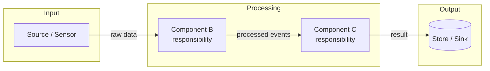
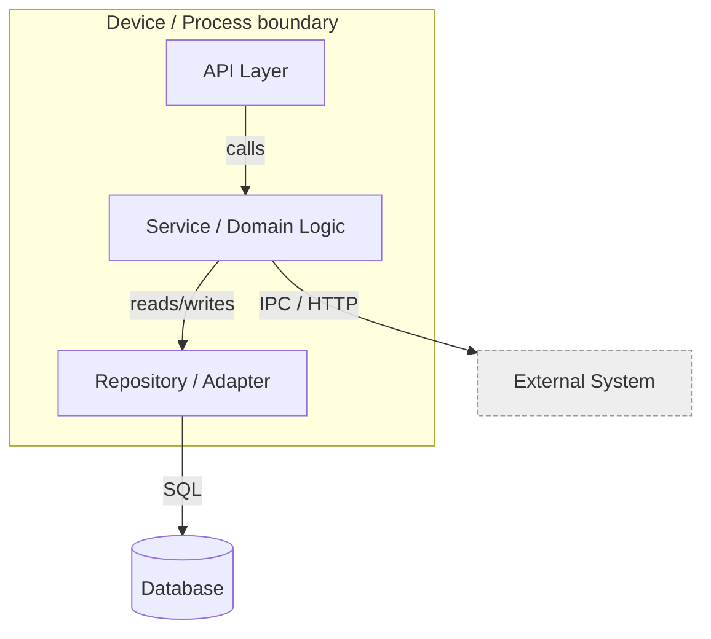
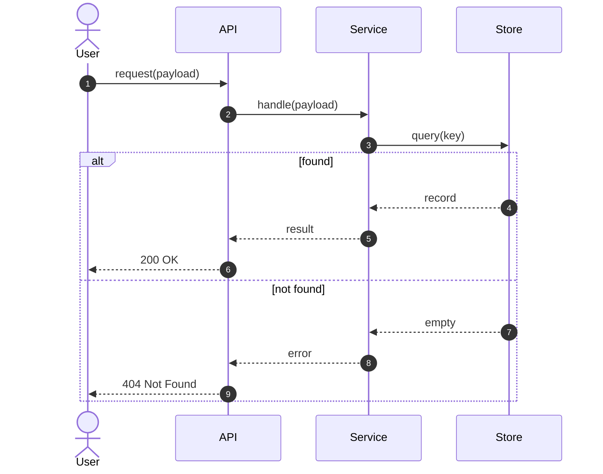

# Diagram template (Mermaid)

Use this template whenever a design is produced (e.g. `/wf planning`, `/wf design`).
Pick the diagram types that fit the design and drop the rest — most designs need at
least an **architectural** diagram plus a **sequence** diagram for the main flow.

Conventions:
- Always wrap diagrams in a fenced ```` ```mermaid ```` block so they render.
- Label every node and edge; edges describe *what* crosses them (data, call, event).
- Keep one diagram per concern. Split rather than crowd a single diagram.
- Name nodes after real components/modules from the design, not generic placeholders.

---

## 1. Block diagram

High-level building blocks and how they connect. Use for "what are the pieces".



---

## 2. Architectural diagram

Components, their grouping (process / service / container boundaries), and the
interfaces between them. Use for "how is it structured and deployed".



---

## 3. Sequence diagram

Ordered interactions over time for one concrete flow. Use for "what happens, step
by step" — include the success path and at least one error/alt branch.


