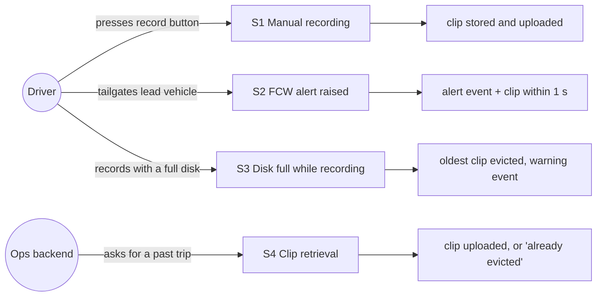
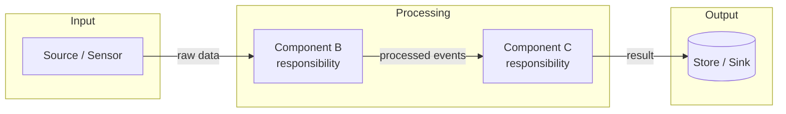
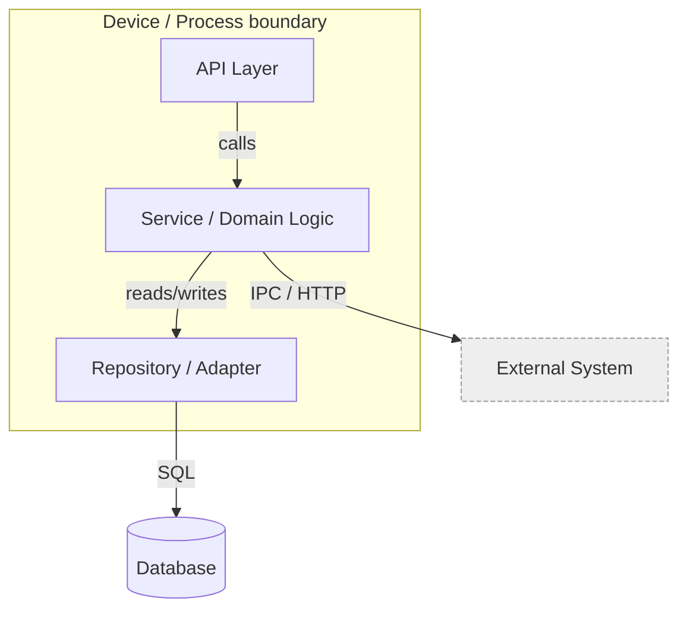
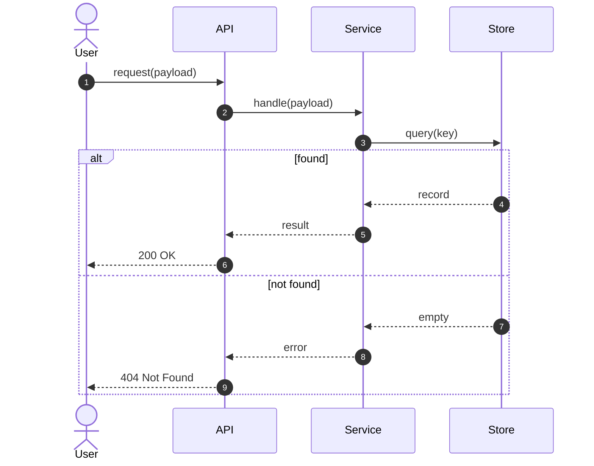

# Diagram template (Mermaid)

Use this template whenever a design is produced (e.g. `/wf planning`, `/wf design`).
Every design overview **starts with the scenario diagram** (§1) — that one is not optional.
After it, pick the diagram types that fit the design and drop the rest; most designs also
need an **architectural** diagram plus a **sequence** diagram for the main flow.

Conventions:
- Always wrap diagrams in a fenced ```` ```mermaid ```` block so they render.
- Label every node and edge; edges describe *what* crosses them (data, call, event).
- Keep one diagram per concern. Split rather than crowd a single diagram.
- Name nodes after real components/modules from the design, not generic placeholders —
  except in the scenario diagram (§1), whose nodes are scenarios and outcomes.

---

## 1. Scenario diagram

Who uses the system, what they do, and what they get back. Use for "what must this thing
do", before a single component exists. **Every design overview opens with this diagram.**

One node per scenario labelled `S<n> <short name>`, the actor on the left, the observable
outcome on the right. Include the scenarios that go wrong — a diagram showing only the
happy path is a design whose failure behaviour was never planned. Name no components here:
this diagram is about behaviour, and naming a module fixes the architecture before the
reader has seen the requirement it serves.


```mermaid
flowchart LR
    Driver((Driver))
    Ops((Ops backend))

    Driver -->|presses record button| S1[S1 Manual recording]
    Driver -->|tailgates lead vehicle| S2[S2 FCW alert raised]
    Driver -->|records with a full disk| S3[S3 Disk full while recording]
    Ops -->|asks for a past trip| S4[S4 Clip retrieval]

    S1 --> O1[clip stored and uploaded]
    S2 --> O2[alert event + clip within 1 s]
    S3 --> O3[oldest clip evicted, warning event]
    S4 --> O4[clip uploaded, or 'already evicted']
```

The `S<n>` ids are the design's stable handles: the test strategy and the end-to-end
walkthrough refer back to them, so a scenario nobody names again is either out of scope or
unbuilt.

---

## 2. Block diagram

High-level building blocks and how they connect. Use for "what are the pieces".


```mermaid
flowchart LR
    subgraph Input
        A[Source / Sensor]
    end
    subgraph Processing
        B[Component B<br/>responsibility]
        C[Component C<br/>responsibility]
    end
    subgraph Output
        D[(Store / Sink)]
    end

    A -->|raw data| B
    B -->|processed events| C
    C -->|result| D
```

---

## 3. Architectural diagram

Components, their grouping (process / service / container boundaries), and the
interfaces between them. Use for "how is it structured and deployed".


```mermaid
flowchart TB
    subgraph Device["Device / Process boundary"]
        direction TB
        api[API Layer]
        svc[Service / Domain Logic]
        repo[Repository / Adapter]
    end

    ext[External System]:::external
    db[(Database)]

    api -->|calls| svc
    svc -->|reads/writes| repo
    repo -->|SQL| db
    svc -->|IPC / HTTP| ext

    classDef external fill:#eee,stroke:#999,stroke-dasharray: 4 2;
```

---

## 4. Sequence diagram

Ordered interactions over time for one concrete flow. Use for "what happens, step
by step" — include the success path and at least one error/alt branch.


```mermaid
sequenceDiagram
    autonumber
    actor User
    participant API
    participant Service
    participant Store

    User->>API: request(payload)
    API->>Service: handle(payload)
    Service->>Store: query(key)
    alt found
        Store-->>Service: record
        Service-->>API: result
        API-->>User: 200 OK
    else not found
        Store-->>Service: empty
        Service-->>API: error
        API-->>User: 404 Not Found
    end
```
