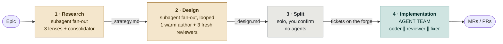
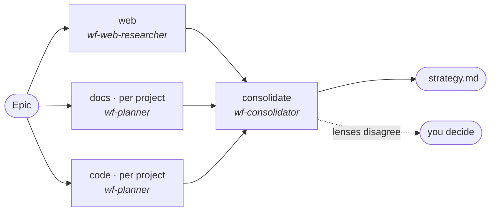
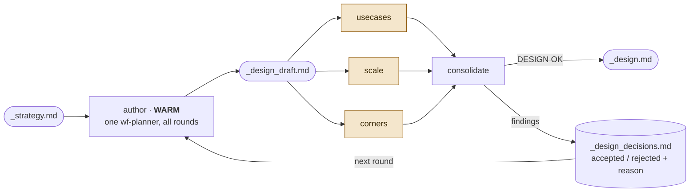
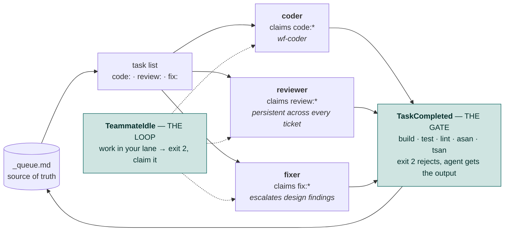

# wf_epic — multi-agent graph engine for epics

Executable form of `template/epic_workflow.md`. Takes a group-level GitLab epic from a question to
merged code in four phases.

```
/wf-epic research       Epic#60    3 lenses + consolidator        -> _strategy.md
/wf-epic design         Epic#60    draft/review/fix loop, <=3     -> _design_{overview,detailed}.md
/wf-epic split          Epic#60    reconcile existing + new (you confirm)
/wf-epic implementation Epic#60    AGENT TEAM, streams tickets    -> MRs
/wf-epic status         Epic#60    the queue
```

## How it works

One session per phase. Sessions share no context — **files are the only handoff.**



| Phase | Mechanism | Agents spawned | Loop | You are asked |
|---|---|---|---|---|
| 1 Research | subagent fan-out | `wf-web-researcher` ×1, `wf-planner` ×2 per project, `wf-consolidator` ×1 | no | only when lenses conflict |
| 2 Design | subagent fan-out | `wf-planner` ×1 **warm**, `wf-reviewer` ×3 **fresh per round**, `wf-consolidator` ×1 per round | ≤3 rounds | on divergence or the cap |
| 3 Split | solo | none | no | **always** — before anything reaches the forge |
| 4 Implementation | **agent team** | teammates `coder`, `reviewer`, `fixer` | ≤2 rounds per ticket | on a blocked ticket |

**Phases 1–3 are joins** — N agents work independently, one merges, everyone waits at the barrier.
**Phase 4 is a stream** — tickets flow continuously and an agent that frees up pulls the next.
Only an agent team can express a stream; that is the sole reason phase 4 uses one.

### Phase 1 — three lenses, one message, no cross-talk



Every prompt carries the silence rule: *write your file and stop, talk to nobody.* Independence is
the whole reason for having three. Disagreements are put to you with the evidence on each side —
never averaged into a third answer nobody proposed.

### Phase 2 — the freshness asymmetry



**The author remembers; the reviewers forget.** The author is continued with `SendMessage` so it
never undoes a deliberate decision while fixing an unrelated finding. The three reviewers (shaded)
are new instances every round: a warm reviewer only checks "did they fix my list", a cold one
re-reads the whole document and catches *what the fix just broke*. A document has no build or test,
so the cold reviewer **is** the regression detector.

The ledger is what terminates the loop — it is fed to each round as *"already considered, do not
re-raise without new evidence."* The 3-round cap is only a backstop.

### Phase 4 — the stream, and the hooks that drive it

At any instant all three stages are running, on different tickets. The bottleneck is the coder, so
the fixer is a separate agent: if the coder did its own fixes the overlap would buy nothing.

```
time ─────────────────────────────────────────────────▶
coder      [ code:T1 ][ code:T2 ][ code:T3 ][ code:T4 ]
reviewer             [ rev:T1 ]  [ rev:T2 ][ rev:T1.r2 ]
fixer                       [ fix:T1 ]     [ fix:T2 ]
```




## Layout

```
wf_epic/
├── SKILL.md            /wf-epic dispatcher, symlinked into .claude/skills/
├── phases/1…4.md       what Claude follows, one file per phase
├── agents/             wf-web-researcher, wf-consolidator (symlinked into .claude/agents/)
├── engine/graph.py     the task graph; owns _queue.md
├── engine/gates.sh     gate commands, anchored to .gitlab-ci.yml's validate stage
├── hooks/              task_completed.sh (THE GATE), teammate_idle.sh (THE LOOP), _payload.py
└── tools/              fetch_epic.py, create_issue.py, seed_epic.py
```

The graph is **not stored as edges** — it is derived from an ordered ticket list plus each ticket's
state, so `_queue.md` stays small enough for you to read and edit by hand.

## Setup

```
claude_workflow/setup.sh
```

